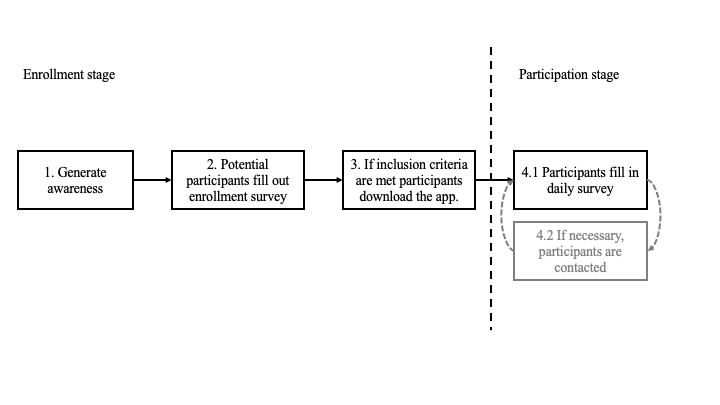

# Large scale, real-time and longitudinal tele-monitoring of COVID-19 in the general population.

> 20-03-2020: Maurice van den Bosch, Joris Janssen, ..[PLEASE MAKE SURE EVERYONE IS INCLUDED - I DON'T CARE ABOUT THE NAMING ORDER].. , Maurits Kaptein.  

**Abstract:** *In this document we describe the initial setup of the large-scale, real-time, longitudinal tele-monitoring of COVID-19 symptoms study (LSRTLT-COV) as setup in the Netherlands. Although the tele-monitoring effort is primarily conceived to alleviate the burden COVID-19 imposes on the healthcare system by allowing healthcare professionals to remotely triage, monitor and comfort potential COVID-19 cases (see [https://luscii.com/nl/corona-virus/](https://luscii.com/nl/corona-virus/)), we believe the collected data is valuable: with this document we aim detail our data collection efforts such that the resulting data can be meaningfully be used by the scientific community.*

## Introduction
We refer the reader to the excellent information on the [WHO website](https://www.who.int/emergencies/diseases/novel-coronavirus-2019) for general background information regarding the COVID-19 virus.

In the Netherlands the first case of COVID-19 was identified on February 27th, 2020. At that time preparations to deal with the impeding crisis were already in full operation. One of the main concerns in the Netherlands &ndash; and globally &ndash; has been managing the burden the crisis imposes on the healthcare system as a whole. One substantial challenge in this regard is to effectively and efficiently manage the demands imposed by a large population of (hitherto healthy) people who turn to the healthcare system when they experience mild symptoms or are otherwise worried or anxious. This population is in need of effective triage, monitoring, and care, but there is a substantial risk that the healthcare system cannot satisfy the peak demand generated by the virus outbreak. Additionally, satisfying this demand might drain resources from the healthcare system that are badly needed elsewhere.

In response to the impeding crisis in the Netherlands, and inline with the arguments presented by Hollander & Carr [[1]](https://www.nejm.org/doi/full/10.1056/NEJMp2003539), one of the largest Dutch hospitals (the OLVG, located in Amsterdam [[2]](https://www.nejm.org/doi/full/10.1056/NEJMp2003539)) together with one of the largest tele-monitoring providers in the Netherlands [[3]](https://luscii.com), set out to develop a tele-monitoring system to triage and attend to potential COVID-19 cases in the general population. Within days, in a joint effort, a tele-monitoring application that allows patients to register potential symptoms was created and released. The complete tele-monitoring system &ndash; which includes both the patient facing application and an interactive dashboard for healthcare providers &ndash; allows healthcare professions to monitor and evaluate the collected data at the level of individual patients. Usage of this system, compared to standard offline care, speeds up the process of continuously triaging large groups of people over a longer period of time thus freeing up valuable resources.

> **Note:** Developing an effective and performant tele-monitoring system takes years, not days. The current application could only meaningfully be created by building upong the existing tele-monitoring infrastructure.

Despite being conceived primarily to relieve the burden imposed on the healthcare system by making triage and monitoring more efficient, the resulting tele-monitoring application collects potentially valuable data. Acknowledging the societal value this data might have we have ensured that all regulations (ethical, legal) are in place to disclose anonymized versions of the resulting dataset to the scientific community. In this document we describe in detail the data collection process and we detail how requests for data can be made. We would like to note that due to the primary goal of relieving the burden on the health-care system we might, at any point in time, make changes to the functionality of the system &ndash; and thus to the data collection process &ndash; that are potentially disadvantageous from a purely scientific point-of-view but are deemed to improve upon the primary goals of the tele-monitoring application. If we make such changes we will update this document accordingly (please see [github](http://...) for versioning of this document).

Below we first provide a high-level overview of the data collection as carried out in the large-scale, real-time, longitudinal tele-monitoring of COVID-19 symptoms study (LSRTLT-COV). Next, we detail the recruitment process, the measurements, and the interactions healthcare-professionals have with the participants using the system. Subsequently, we provide an overview of the resulting data and detail how requests for data can be made by members of the scientific community. Finally, we discuss the known limitations of our approach.

### High level overview of the collected data
Before providing details regarding inclusion and data collection we first outline the general approach. Figure 1 shows the steps involved in the LSRTLT-COV study:

1. First, potential participants are made aware of the existence of the app both through the media and by interacting with health-professionals; participants subsequently voluntarily decide to enroll.
2. After the decision to enroll, potential participants fill out a short online survey.
3. If participants meet the inclusion criteria they are able to download the tele-monitoring application and enroll in the LSRTLT-COV study.
4. Once enrolled, participants are:
	1. Prompted daily to measure and submit a number of health indicators (i.e., we use a form of experience sampling [[4]](https://link.springer.com/chapter/10.1007/978-94-017-9088-8_2))
	2. (optionally) Contacted by health care professionals either via email or phone if their individual health data generates an alert).

Steps 4.1 and 4.2 are repeated daily for an &ndash; as of the current writing &ndash; undetermined period of time. 

Below we provide exact details and methodological considerations regarding each step of this process. We first describe the recruitment process, and subsequently describe measurements obtained both in the online survey and in the daily experience sampling surveys. Next, we describe the potential interactions and the mechanisms that trigger alerts for the healthcare professions attending the system. 

## Participants
Here we describe the details of the enrollment process in the LSRTLT-COV study.

### Awareness
Potential participants start enrollment by signing up at the webpage [https://cvitals.focuscura.com/en/olvg-corona-check](https://cvitals.focuscura.com/en/olvg-corona-check). Participants awareness of the existence of this webpage is has &ndash; up till now &ndash; been generated via different means:

1. Via a message on the intranet of the OLVG hospital (March 14, 2020). This campaign reached hospital employees.
2. Via messages in the local Amsterdam news (both newspaper and new broadcast (March 16, 2020). 
3. Via broadcast in the national Dutch news (March 18, 2020).

Additionally, awareness might be raised through word-of-mouth, and prospective participants might be referred to the webpage by various healthcare professionals.

> **Note:** It is important to note that after awareness is created, participants voluntarily sign up. Hence, there is a clear (self-) selection bias. We are not fully in control of the word-of-mouth nor the mentions of the LSRTLT-COV tele-monitoring application in the various media and hence we only have limited control over this part of the sampling process.

### Inclusion criteria
Once a prospective participant decides to enroll, she / he fills out a short introduction survey (see the "[Measurements in introduction survey]()" section below for more details). Based on the provided answers a participant is automatically included and forwarded to the page where the tele-monitoring application can be downloaded if:

1. She / he is 18 years of age or older,
2. Lives in a region with postal code 1000 to 1119 (the greater Amsterdam area).

No other inclusion criteria are checked. 

The tele-monitoring application has been tested and approved for mobile devices running IoS 11 or higher or Android 7 or higher, and hence prospective participants who do not have access to such a device will drop out at this point in the enrollment process. Finally, to properly fill out the daily surveys participants need to have access to a functioning thermometer; access to a thermometer is however not enforced during the enrollment process.

> **Note:** Inclusion criterion 2 (the geographic location) is currently (March 20, 2020) present to control the case load on the system; this restriction is likely lifted in the future. 

### Participant groups
Based on the answers provided participants are allocated to one of 5 groups:

1. *"Healthcare professionals"*: any participant indicating to work in healthcare in the greater Amsterdam area.
2. *"Non-vulnerable OLVG participants"*: any participant who is a registered patient at the OLVG hospital and is deemed not vulnerable (see below).
3. *"Non-vulnerable, non-OLVG participants"*: : any participant who is not a registered patient the OLVG hospital and is deemed not vulnerable (see below).
4. *"Vulnerable OLVG participants"*: any participant who is a registered patient at the OLVG hospital and is deemed vulnerable (see below).
5. *"Vulnerable, non-OLVG participants"*: : any participant who is not a registered patient at the OLVG hospital and is deemed vulnerable (see below).

Participants are deemed vulnerable if:
	
- They are 70 years of age or older, OR
- They use immunosuppressive medication, OR,
- They have been diagnosed with a) chronic lung problems, b) heart disease, c) diabetes, OR d) an immune disorder.
	
> **Note:** The above OR's are inclusive).
	
Group membership is not communicated to participants but is used in interactions with the participants; for details see the "interaction with participants" section below.
	
Finally, at this point in the text it is insightful to know that two more participant groups exist: 6. *"COVID-positive"* participants and 7. *"Cured"* participants. Allocation to these groups happens during interaction; for details see the "Additional group membership" section below.

## Measurements
Effectively two different surveys are administered to participants: the introduction survey and the daily experience sampling survey. The latter is, in the exact same form, administered multiple times. Here we list the measures included in each.

### Measurements in introduction survey
The introduction survey consists of the following questions:

- `email`: "Please fill out your email:"
- `name`: "Please fill out your name:"
- `surname`: "Please fill out your surname:"
- `gender`: "Gender (not obligatory):" with answer categories:
	- Female
	- Male
	- Unknown / other
- `postal-code`: "The first four digits of your postal-code:"
- `telephone`: "Telephone number:"
- `provider`: "Are you a healthcare provider?" with answer categories:
	- "Yes, I am a healthcare provider at the OLVG"
	- "Yes, I am a healthcare provider at another health organization in Amsterdam"
	- "Yes, I am a healthcare provider outside of Amsterdam"
	- "No, I am not a healthcare provider"
- `diagnose`: "Do you have one of the following diagnosis:" with answer categories:
	- "Yes, chronic lung problems"
	- "Yes, heart disease"
	- "Yes, diabetes"
	- "Yes, an immune disorder"
	- "Yes, multiple of the above"
	- "No"
- `olvg`: "Have you been treated at the OLVG in the last two years?" with answer categories:
	- "Yes"
	- "No"
- `olvg-number`: "If yes, provide your OLVG patient number (not obligatory):"
- `medication`: "Do you use any immunosuppressive medication?" with answer categories:
	- "Yes"
	- "No"
- `corona`: "Have you been tested for the Corona Virus?"  with answer categories:
	- "Yes, I was tested positive (you have corona)"
	- "Yes, I was tested negative (no corona)"
	- "Yes, but the result is not yet known"
	- "No"
- `date-of-birth`: "Date of birth:"
- `age-group-1`: "To which age category do you belong?" with answer categories:
	- "0 up to 18 years"
	- "18 to 70 years"
	- "70 years or older"

After filling out these questions participants are asked to read and comply to the general terms [https://luscii.com/wp-content/uploads/2018/04/FAQ_1.0.pdf](https://luscii.com/wp-content/uploads/2018/04/FAQ_1.0.pdf).

> **Note:** The names in `code`-font indicate variable-names in the resulting dataset. See also the section Available Data below.

### Daily measurements
The daily experience sampling surveys measure the following:

- `temperature`: "Please measure and fill out your temperature:"
- `throat`: "Do you have a throat ache?" with answer categories:
	- "Yes"
	- "No"
- `nasal`: "Do you have a nasal cold or do you sneeze?" with answer categories:
	- "Yes"
	- "No"
-  `breath`: "Do you experience a breath shortage? "  with answer categories:
	- "0, None"
	- "1", ... , "4" (not labelled)
	- "5, Yes, this causes me to walk slower than my peers"
	- "6", ..., "9" (not labelled)
	- "10, Yes, even when in bed or otherwise resting".
- `cough`: "How badly have you been coughing in the last 24 hours?"  with answer categories:
	- "0, Not at all"
	- "1", ...., "9" (not labelled)
	- "10, heavily and continuously"
- `call`: "Would you like to receive a phone-call? with answer categories:
	- "Yes"
	- "No"

> **Note:** All questions and answer categories have been translated from Dutch; we have tried to maintain their semantics a much as possible.

> **Note:** In an early versions (v1.0 and v1.1) of the application an additional free-text `comment` field was added. This field was later removed because although all of these comments needed to legally be manually attended to by healthcare professionals most of the comments did not relate to the participants health and thus the use of this field was deemed inefficient.

## Interactions with participants
During the participation stage of the LSRTLT-COV study there are various interactions with the participants. These can be grouped into two sets: "automatically generated prompts", and "other interactions initiated by alerts". We detail each in turn. 

### Prompts
Prompts are either email messages and / or phone notifications (depending on participants settings, participants can also turn these off) which are automatically generated every day to remind participants of the daily survey. To control the load on the system not all prompts are send at the same time but rather the timing depends on the group membership:

1. "Healthcare professionals": Receive a daily prompt at 11.00am.
2. "Non-vulnerable OLVG participants": Receive a daily prompt at 1.00pm.
3. "Non-vulnerable, non-OLVG participants": Receive a daily prompt at 2.00pm.
4. "Vulnerable OLVG participants": Receive a daily prompt at 10.00am.
3. "Vulnerable, non-OLVG participants": Receive a daily prompt at 10.00am.

If no data is submitted, the prompt is repeated after 4 hours. Finally, if there are notifications for participants (which are inserted by the healthcare professionals who monitor the patients, see below), a prompt is send early morning (08.00 or 09.00am depending on the group membership of the receiving participant).

### Interactions due to alerts
Besides the prompts, several interactions between the health-care professionals who monitor the incoming data and the participants can occur. These interactions are initiated by alerts that are each day generated automatically by the tele-monitoring system based on the data supplied by the participants. These alerts are subsequently displayed to the healthcare professionals who monitor the participants and the healthcare professionals take various actions accordingly. The rules that lead to different alerts types &ndash; "RED", "GREY", and "AMBER" &ndash; depend on the group membership:

1. "Healthcare professionals": 
	- If `temperature > 37.9`: "RED" alert.
	- If `breath > 5` AND the `breath` score has increased by more than 2 points: "RED" alert.
	- If `call` == "yes": "AMBER" alert.
2. "Non-vulnerable OLVG participants": 
	- If `temperature > 37.9`: "RED" alert.
	- If `breath > 5` AND the `breath` score has increased by more than 2 points: "RED" alert.
	- If `call` == "yes": "AMBER" alert.
3. "Non-vulnerable, non-OLVG participants": 
	- If `temperature > 37.9`: "RED" alert.
	- If `breath > 5` AND the `breath` score has increased by more than 2 points: "RED" alert.
	- If `call` == "yes": "AMBER" alert.
4. "Vulnerable OLVG participants": 
	- If `temperature > 37.4`: "RED" alert.
	- If `breath > 5` AND the `breath` score has increased by more than 2 points: "RED" alert.
	- If `call` == "yes": "AMBER" alert.
5. "Vulnerable, non-OLVG participants": 
	- If `temperature > 37.4`: "RED" alert.
	- If `breath > 5` AND the `breath` score has increased by more than 2 points: "RED" alert.
	- If `call` == "yes": "AMBER" alert.

Finally, if participants who are still using v1.0 or v1.1 create a `comment`, a "GREY" alert is raised.

Alerts are subsequently responded to in the following way:

- "RED" alerts: The monitoring healthcare professional decides to either call the participant or send a message. Depending on the data the message either encourages participants to stay at home, or, in the phone-call, potential alternative actions such as visiting the hospital are discussed.
- "AMBER" alerts: The monitoring healthcare professional decides to indeed call the participant or alternatively send a message to comfort the participant without actually calling.
- "GREY" alerts: The monitoring healthcare professional decides to either call the participant, send a message, or do nothing.

> **Note:** We are continuously trying to improve the interactions and to improve their efficiency. Hence, the rules that initiate interactions can change on a **daily** basis.

> **Note:** All the interactions between healthcare professionals and participants are logged; if these are deemed essential for any subsequent analysis these can potentially be retrieved. The rules are dictated by the [RIVM](https://www.rivm.nl/nieuws/actuele-informatie-over-coronavirus).

### Additional group membership: *COVID positive* and *cured*

Next to the 5 participant groups detailed above, two more groups exist in the LSRTLT-COV study:

* 6. *"COVID-positive"* participants: Participants are allocated to this group if the either score high on `cough > 5` and have a fever OR score high on `breath > 5` and have a fever where fever is dependent on prior group membership (see above).
* 7. *"Cured"* participants: Participants are allocated to this group if, after being in the "COVID positive" group they are relieved of any symptoms for more than a day.

Finally, the alert rules for "COVID positive" participants are as follows:

- If `temperature > 38.9`: "RED" alert.
- If the `breath` score has increased by more than 1 point: "RED" alert.
- If `call` == "yes": "AMBER" alert.

## Available data
The setup described above effectively leads to two datasets which jointly include the majority of collected information. We aim to share with the scientific community, upon request (see below) the following data:

### Dataset 1: the introduction survey
This dataset contains the following fields (see measurements for additional details):

- `id`: A unique participant id.
- `day`: Day the data was collected since start of measurements; March 14, 2020 equals 1.
- `gender` 
- `postal-code`: Only if properly motivated.
- `provider`: Only if properly motivated. 
- `diagnose`: Only if properly motivated.
- `medication`
- `corona`
- `age-group-2`: Age recoded into 5-year categories; 18-24,25-29,30-34,...

### Dataset 2: the daily surveys

- `id`: The participant id (same as used in dataset 1), can occur multiple times due to the repeated measures.
- `day`: Day the data was collected since start of measurements; March 14, 2020 equals 1.
- `temperature`
- `throat`
- `nasal`
- `breath`
- `cough`
- `call`
- `group`: The participant group (1-7) the participant is allocated to at this moment in time.

> **Note:** In this dataset each `id-day` combination provides a unique key for each row.

## Current results
> **Note:** These numbers were last updated updated 20-03-2020, 14.08h, CET.

While this document does not aim to provide any analysis of the collected data, we do provide a few overview statistics to provide a sense of scale of the dataset:

- Total number of participants filling out the introduction survey: **32.877**
- Total number of participants filling out a daily survey today: **26.416**
- Total number of participants per group:
	1. "Healthcare professionals": **2.731**
	2. "Non-vulnerable OLVG participants": **6.975**	3. "Non-vulnerable, non-OLVG participants": **14.959**
	4. "Vulnerable OLVG participants": **3.754**
	5. "Vulnerable, non-OLVG participants": **3.151**
	6. "COVID-positive": **1.301**
	7. "Cured:" 0
8. Total number of daily surveys: **> 100.000**

## Discussion
With this document we have tried to present a full overview of our data collection process in the LSRTLT-COV study such such that researchers can make informed and meaningful requests for data and can validly judge any analysis based on the collected data. Here we mention a few methodological points that should be considered by anyone analyzing this data:

1. The sampling process is somewhat outside of our control. Although the participant group is large (and rapidly growing), it will contain self-selection bias. Weighting by age and gender might help to make the results more representative.
2. We only know the location of the participant when they sign up (i.e., we know the postal code of their house). We do not have any further information on the whereabouts, mobility, or network of participants.
3. As the tele-monitoring application is not designed as a measurement device, but rather as a practical tool to help control the burden on the healthcare system during the current corona crises, we might interact with participants during the data collection in ways that might influence the collected data. We are trying to log all relevant interactions and disclose any rules that trigger prompts and alerts (and how these change over time), but it is hard to judge to what extend interactions with healthcare professionals might (e.g.,) change scale usage by participants over time and hence impact data analysis. 
4. While there is potential to match our data with other data sources, such matching has not been foreseen in our legal and ethical statements at this point in time. This might change, but for now we will not provide any keys / id's that can be used to match individual cases to other -- potentially publicly available -- datasets.
5. We currently do not actually know whether a participant has truly been tested positive for COVID-19; our group *"COVID-positive"* participants does **not** by construction consist of participants who have tested positively using PCR or CT-scan test (although it might include such participants).

> **Note:** Additional comments are welcome; we gladly add all important considerations to this list.

## Data requests
We encourage data requests by fellow researchers. A request can be filed by sending the answers to the following questions to [lsrtlt-cov@luscii.com](mailto:lsrtlt-cov@luscii.com):

1. Who are you? Please provide email, name, and affiliations.
2. What would you like to use this data for? Please provide a short rationale for requesting this specific dataset.
3. What information do you need? Please state which data (i.e., which variables, over what time period, etc.) you are interested in. Note that the datasets grow large very quickly; please request only the subsets needed to answer your questions.
4. How do you intend to disclose your results? We encourage open publication and sharing of any analysis code. 

> **Note:** We are trying actively to keep track of where this data is being used and for what purposes; before sharing any data we will ask you to sign a form stating that you will not disclose any of the raw data to third parties.

We are trying to handle data requests **daily**, but given the current situation we cannot make any guarantees. Data requests are handled by our scientific board consisting of:

- INSERT

> **Note:** We expect anyone who uses our collected data to acknowledge the source; please do so by referencing... [INSERT]()

## Conclusion
We would like to close this document by reiterating that the primarily goal of the tele-monitoring system used in the LSRTLT-COV study is to relieve the burden imposed on the healthcare system by making triage and monitoring more efficient. Therefore, along the way, not all the choices that we make are solely driven by scientific methodological rigor. Sometimes practical demands steer our decision making. We however sincerely believe that despite this, the resulting data are valuable: at the very least the data provide an understanding of the progression, over time, of early symptoms as experienced by patients while the crisis is ongoing. However, there might be many more uses, possibly ones that we did not foresee. Therefore, we encourage well motivated data requests. We hope the current document allows the scientific community to properly understand the data collection.

